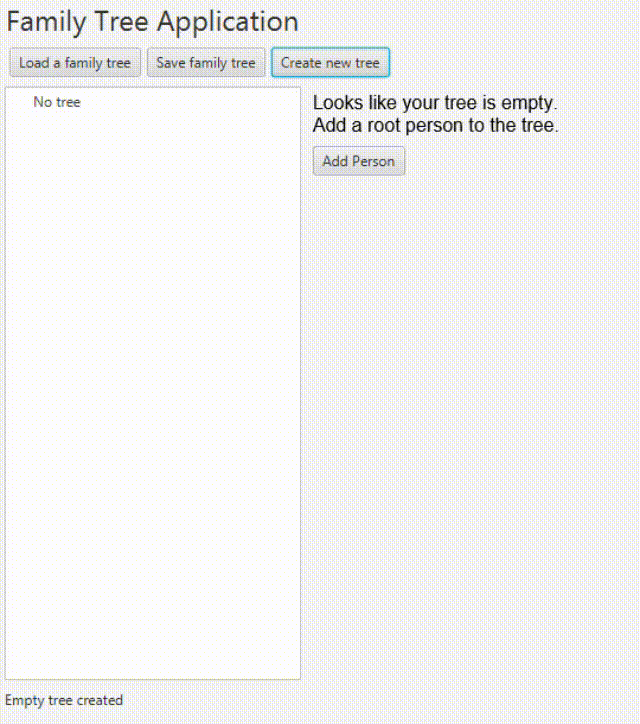

# Family Tree Desktop App
The family tree application allows users to create their own family tree which is displayed on JavaFX's `TreeView` showing the heirachical relationship between the members. Details of a family member that include their name, surname, gender, short description and address are displayed on the details pane on the right.

# Installation
The application is written in Java 8 which is minimum requirement to run the program. Older versions may not work as some new features of Java 8 were utilised in the application. **Note that the application was developed for desktop only.** 

# Usage
The example below shows how the `TreeView` will look when a new tree is created and with new members added to it.

# Limitations
- The heirachy of the tree is limited to only one level meaning that children of the root member cannot have children or spouses of their own and so on. 
- The program at times does not display all the members under the relatives section on the details pane on the right. 
- The list of children exceed the length the width of the window and new children added cannot be seen.
